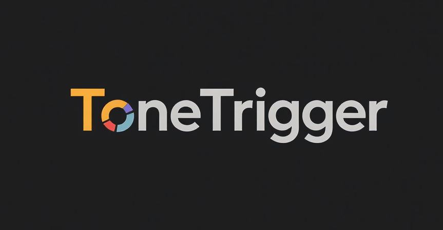

# ToneTrigger



## Overview

ToneTrigger is a comprehensive professional-grade live guitar processing application that dynamically switches audio effects based on real-time musical analysis. By leveraging advanced audio processing algorithms, MIDI integration, and sophisticated trigger systems, ToneTrigger provides an unparalleled performance experience for guitarists. Whether you're a live performer, studio musician, or experimental artist, ToneTrigger enhances your creativity by intelligently automating effect changes in perfect sync with your playing.

## Key Features

### 🎸 **Advanced Audio Processing**
- **Real-Time Audio Analysis**: Low-latency guitar input processing with sub-10ms latency
- **Intelligent Note Detection**: Advanced pitch detection using autocorrelation algorithms
- **Comprehensive Chord Recognition**: 20+ chord types including extended jazz chords with confidence scoring
- **Melody Pattern Analysis**: Real-time melodic sequence and motif recognition
- **Harmonic Content Analysis**: Spectral analysis and harmonic tracking

### 🎛️ **Professional Audio Effects**
- **Distortion**: Soft-clipping distortion with drive and tone controls
- **Reverb**: FDN-based reverb with room size, damping, and wet/dry mix
- **Delay**: Echo delay with time, feedback, and mix parameters
- **Chorus**: LFO-modulated chorus with rate, depth, and mix controls
- **Filter**: Multi-mode filter (Low-pass, High-pass, Band-pass, Notch) with resonance and drive
- **Compressor**: Professional compressor with threshold, ratio, attack, release, and makeup gain

### 🎹 **Complete MIDI Integration**
- **MIDI Device Management**: Full MIDI input/output support with automatic device detection
- **MIDI Learn System**: Map any MIDI controller to any effect parameter
- **MIDI Clock Sync**: Synchronization with external MIDI clock sources
- **MIDI Recording & Playback**: Record MIDI data and play standard MIDI files
- **Real-Time Control**: Live parameter adjustment via MIDI controllers

### 🎯 **Advanced Trigger System**
- **Note Triggers**: Trigger effects on specific notes or note ranges
- **Chord Triggers**: Trigger effects on chord recognition with confidence thresholds
- **Melody Triggers**: Trigger effects on melodic patterns and sequences
- **Amplitude Triggers**: Trigger effects based on input level and dynamics
- **Temporal Triggers**: Time-based effect activation and scheduling
- **Combination Triggers**: Multiple condition triggers for complex scenarios

### 📊 **Real-Time Visualization**
- **Waveform Display**: Real-time waveform visualization with customizable scaling
- **Spectrum Analyzer**: Frequency spectrum with peak hold and customizable resolution
- **Waterfall Display**: 3D frequency-time visualization for spectral analysis
- **Oscilloscope**: Real-time oscilloscope display for waveform analysis
- **Customizable Interface**: User-defined color schemes, grid, and labels

### 💾 **Comprehensive Preset Management**
- **Complete Presets**: Save all settings including effects, triggers, and audio configuration
- **Effect Presets**: Individual effect parameter presets with automation
- **Trigger Presets**: Save and load trigger configurations
- **Audio Presets**: Audio device and processing settings
- **Import/Export**: Share presets via files with backup and restore functionality
- **Preset Categories**: Organize presets into categories and templates

### 🔧 **Advanced Configuration**
- **Audio Settings**: Sample rate, buffer size, device selection with low-latency optimization
- **Effect Chains**: Multiple effects in series with individual bypass controls
- **Parameter Automation**: MIDI-controlled parameter changes and automation
- **Performance Monitoring**: Real-time latency, CPU usage, and memory tracking
- **Cross-Platform**: Native support for Windows, macOS, and Linux

## Tech Stack

- **JUCE (C++)**: Core framework for low-latency audio processing, MIDI integration, and cross-platform UI
- **Advanced DSP Algorithms**: Custom implementations for real-time audio analysis and effect processing
- **MIDI Framework**: Complete MIDI device management and protocol handling
- **CMake**: Modern build system for managing dependencies and cross-platform compilation
- **Real-Time Audio**: Optimized for sub-10ms latency with efficient buffer management
- **Professional Effects**: Industry-standard audio effects with parameter automation

## Installation

### Prerequisites
- C++17-compatible compiler (e.g., GCC, Clang, MSVC)
- CMake 3.15 or higher
- JUCE 7.x or higher
- Audio interface for low-latency guitar input (e.g., Focusrite Scarlett, iRig, Behringer UMC)
- MIDI controller (optional, for external control)
- 4GB RAM minimum, 8GB recommended
- Modern multi-core processor for optimal performance

### Build Instructions
1. Clone the repository:
   ```bash
   git clone https://github.com/makalin/ToneTrigger.git
   cd ToneTrigger
   ```

2. Install dependencies:
   - **JUCE**: Download and install from [JUCE Downloads](https://juce.com/get-juce/download)
   - **CMake**: Install from [CMake Downloads](https://cmake.org/download/)
   - **Audio Interface**: Ensure your audio interface drivers are installed

3. Build using the provided script:
   ```bash
   chmod +x build.sh
   ./build.sh
   ```

4. Or build manually:
   ```bash
   mkdir build
   cd build
   cmake .. -DCMAKE_BUILD_TYPE=Release
   cmake --build . --config Release
   ```

5. Run ToneTrigger:
   - **Windows**: `./build/bin/ToneTrigger.exe`
   - **macOS**: `./build/ToneTrigger.app` or `./build/bin/ToneTrigger`
   - **Linux**: `./build/bin/ToneTrigger`

For detailed build instructions, see [BUILDING.md](BUILDING.md).

For comprehensive feature documentation, see [FEATURES.md](FEATURES.md).

## Usage

1. **Connect Your Guitar**:
   - Plug your guitar into an audio interface connected to your device.
   - Configure the audio input/output in ToneTrigger’s settings.

2. **Set Triggers**:
   - Open the UI and navigate to the "Triggers" tab.
   - Define note/chord triggers (e.g., "C4" or "Cmaj") or upload a MIDI file for melody-based triggers.
   - Assign effects (e.g., distortion, reverb) to each trigger.

3. **Play and Experiment**:
   - Start playing your guitar. ToneTrigger will detect your predefined triggers and switch effects in real time.
   - Adjust effect parameters (e.g., reverb depth, delay time) via the UI.

4. **Save Presets**:
   - Save your trigger and effect configurations for future performances.

### 🎛️ **Advanced Usage Features**
- **MIDI Integration**: Connect MIDI controllers for hands-free parameter control
- **Real-Time Visualization**: Monitor your signal with waveform, spectrum, and waterfall displays
- **Advanced Triggers**: Set up complex trigger conditions with confidence thresholds
- **Effect Chains**: Create sophisticated effect chains with individual bypass controls
- **Performance Monitoring**: Track latency, CPU usage, and audio statistics in real-time
- **Preset Management**: Organize and share presets with import/export functionality

## Roadmap

### 🚀 **Upcoming Features**
- **Cloud Integration**: Cloud-based preset sharing and collaboration
- **Machine Learning**: AI-powered analysis and intelligent effect suggestions
- **Plugin Export**: VST3/AU/AAX plugin export for DAW integration
- **Advanced Visualization**: 3D audio visualization and immersive displays
- **Network Features**: Real-time remote control and multi-user collaboration

### 🎯 **Advanced Analysis**
- **Neural Networks**: Deep learning for advanced audio analysis
- **Pattern Recognition**: Sophisticated musical pattern detection
- **Genre Classification**: Automatic genre and style identification
- **Mood Analysis**: Emotional content and musical mood detection
- **Style Recognition**: Playing style and technique identification

### 🌐 **Collaboration Features**
- **Real-time Collaboration**: Multi-user live performance support
- **Preset Marketplace**: Community preset sharing and rating system
- **Remote Control**: Web-based remote control interface
- **Streaming Integration**: Live streaming platform integration
- **Social Features**: Community features and artist profiles

### 📱 **Mobile & Web**
- **iOS/Android Apps**: Mobile companion applications
- **Web Interface**: Browser-based control and monitoring
- **Cross-Platform Sync**: Seamless synchronization across devices
- **Mobile Control**: Smartphone/tablet remote control
- **Cloud Backup**: Automatic cloud backup and restore

## Contributing

We welcome contributions! To contribute:
1. Fork the repository.
2. Create a feature branch (`git checkout -b feature/your-feature`).
3. Commit your changes (`git commit -m "Add your feature"`).
4. Push to the branch (`git push origin feature/your-feature`).
5. Open a pull request.

Please follow our [Code of Conduct](CODE_OF_CONDUCT.md) and submit issues for bugs or feature requests.

## License

This project is licensed under the MIT License. See [LICENSE](LICENSE) for details.

## Contact

For questions or feedback, reach out via [GitHub Issues](https://github.com/makalin/ToneTrigger/issues) or send e-mail to makalin@gmail.com.
